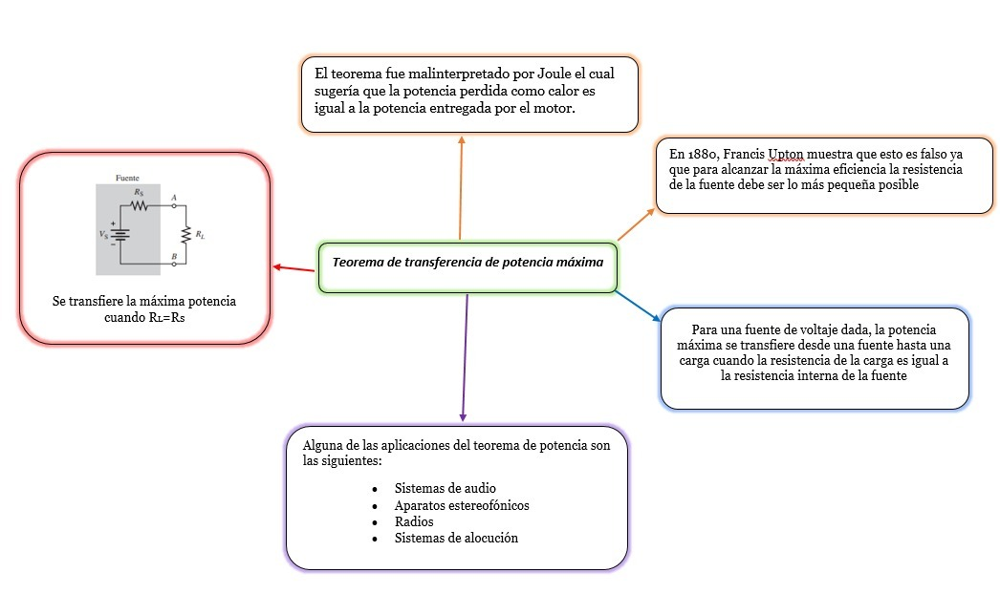
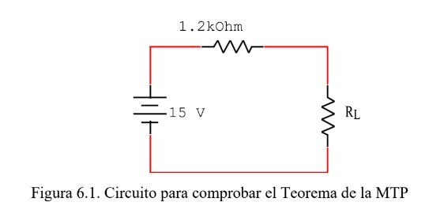
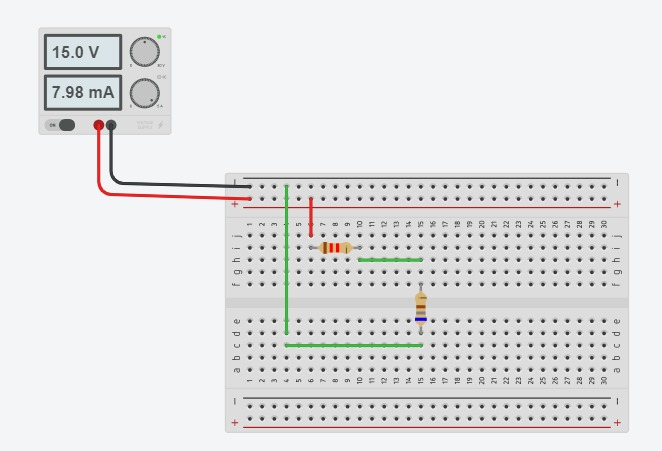
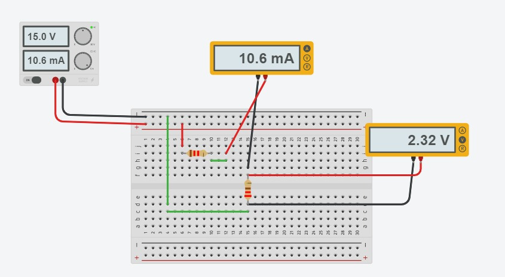
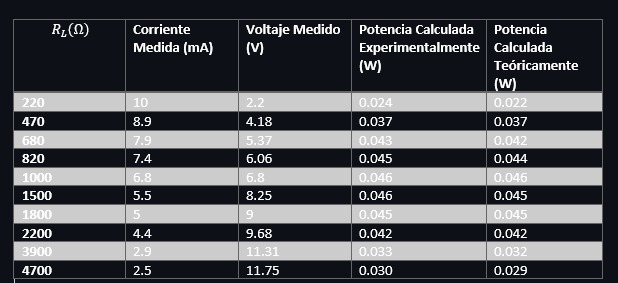

# Informe6

## PRÁCTICA No. 6 TEOREMA DE LA MAXIMA TRANSFERENCIA DE POTENCIA

1. OBJETIVOS

1.1 OBJETIVO GENERAL

- Implementar el conocimiento de superposición para comprobar digitalmente y analíticamente los resultados calculados para que posteriormente sean comparados.
- Comprobar experimentalmente el Teorema de la Máxima Transferencia de Potencia.

1.2 OBJETIVOS ESPECIFICOS
- Analizar circuitos mediante superposición.
- Rediseñar circuitos para facilitar su resolución.
- Simular circuitos digitalmente.
- Comparar los resultados simulados y calculados.

2. REQUISITOS PREVIOS

Se requiere el análisis analítico del circuito mostrado en la figura 4.1., aplicando el Teorema de Superposición. Obtenga los valores de VA e IX, respetando tanto la polaridad del voltaje como el sentido de la corriente que se proporcionan y anote los resultados en la tabla 4.1. y 4.2. según corresponda.

3. INFORMACION GENERAL

La cantidad de potencia que una fuente de voltaje puede suministrar está limitada por su resistencia interna RS.

**El Teorema de la Máxima Transferencia de Potencia establece que:**

***Una fuente de voltaje entrega la máxima transferencia de potencia a una resistencia
de carga RL, cuando el valor de esta resistencia es igual a la resistencia interna de la
fuente, RS.***

El uso de los simuladores virtuales para la comprensión de los temas en eléctronica es bueno debido a que:

- Eliminan riesgos de contacto con algunas sustancias o materiales, permitiendo a los estudiantes centrarse en lo que va a estudiar.
- Retroalimentación rápida gracias a la rapidez de los resultados, por esto se puede corregir o confirmar las acciones realizadas.
- Mejores para el aprendizaje individual, ya que él estudiante tendrá que manejar el simulador, observar los resultados y actuar en consecuencia.

4. MATERIAL Y EQUIPO REQUERIDO

| Cantidad | Material o Equipo | 
| --------- | --------- | 
| 1 | Fuente de Voltaje de C.D. | 
| 1 | Multímetros Digitales | 
| 1 | Resistor de 220 Ω |
| 1 | Resistor de 470 Ω | 
| 1 | Resistor de 680 Ω | 
| 1 | Resistor de 820 Ω |
| 1 | Resistor de 1 kΩ  |
| 1 | Resistor de 1.5 kΩ|
| 1 | Resistor de 1.8 kΩ |
| 1 | Resistor de 2.2 kΩ |
| 1 | Resistor de 3.9 kΩ |
| 1 | Resistor de 4.7 kΩ |
| 1 | Protoboard | 
5. PROCEDIMIENTO

5.1 Arme el circuito que se presenta en la figura 6.1.

5.2 Mida el voltaje y la corriente para cada valor de RL que se indica en la tabla 6.1. Anote los resultados medidos.

5.3 Calcule las potencia consumida por RL, para cada valor dado y anote los resultados en la tabla 6.1.

5.4 ¿Se cumple el Teorema de la Máxima Transferencia de Potencia? Argumente su respuesta.

No se cumple el teorema ya que ninguna resistencia RL tenia el valor igual a la resistencia de la fuente

5.5 ¿Cuál fue la potencia máxima en RL? 

La potencia maxima fue 0.046 Watts

5.6 ¿Para qué valor de RL se obtiene la MTP? 

Para 1000 Ω

Tabla 6.1. Parámetros Eléctricos del circuito de la figura 6.1.

6. VIDEO

7. CONCLUSIONES

Se pudo comprobar que los valores obtenidos de los voltajes como de las corrientes fueron muy semejantes a los obtenidos mediante verificar el circuito analiticamente, con unos pequeños margenes de error. Asi mismo tanto para las tablas obtenidas, se comprobó el uso del teorema de superposición, mediante las ecuaciones encontradas, los cálculos obtenidos nos asemejan a una silmulación real, todo este proceso de usar la ley antes mencionadas nos permiten a que los valores sean precisos y casi exactos, apoyandonos del mismo ciruito para usar las fórmulas como la dirección de los voltajes y corrientes.

El teorema de la máxima transferencia de potencia se deriva del teorema de Thevenin y el de Norton con algunos pasos extras de cáculo elemental. Llegamos a la demostración teórica, evidentemente la máxima potencia se originará cuando la resistencia de carga tenga un valor semejante a la resistencia de Thevenin o Norton.

8. BIBLIOGRAFÍA

- IGNITE "Simuladores virtuales: recursos de apoyo en el proceso de aprendizaje"Recuperado de: https://igniteonline.la/simuladores-virtuales-recursos-de-apoyo-en-el-proceso-de-aprendizaje/
- Floyd Thomas L, “Principios de Circuitos Eléctricos”, 8 ed. 2007 .Pearson Educación de México, S.A. de C.V. México, pp. 281-333.
